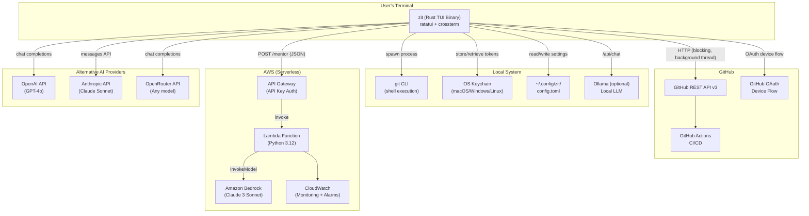

# TECHNICAL APTNESS & FEASIBILITY (30%)

## System Architecture

## Why I Chose Each Technology

| Technology | Why This Over Alternatives |
|-----------|--------------------------|
| **Rust** | Memory safety without GC. Single binary. Cross-platform. Ideal for CLI tools. (vs Go: better type system + zero-cost abstractions; vs Python: 100x faster, no runtime dependency) |
| **Ratatui** | The standard TUI library in Rust ecosystem. Immediate-mode rendering is simple and efficient. (vs Cursive: less maintained; vs building raw ANSI: reinventing the wheel) |
| **Shell-based Git** | 100% compatibility with user's git config, hooks, credential helpers. (vs libgit2: incomplete API coverage; vs gitoxide: still maturing) |
| **reqwest** | Best Rust HTTP client — supports blocking mode, JSON, TLS. (vs hyper: too low-level; vs ureq: less features) |
| **AWS Lambda + Bedrock** | Serverless = zero ops. Bedrock = no model hosting. Pay per request. (vs self-hosted: requires server management; vs direct API: Lambda adds API key auth + rate limiting) |
| **SAM/CloudFormation** | One-command deployment. Infrastructure as code. (vs Terraform: overkill for one function; vs manual: not reproducible) |
| **Multi-provider AI** | User choice + cost flexibility. Ollama = free + private. (vs locked to one provider: limits adoption) |
| **Keyring** | OS-native secret storage. (vs plaintext config: insecure; vs custom encryption: reinventing the wheel) |

## Technical Constraints & How I Handle Them

| Constraint | How I Handle It |
|-----------|----------------|
| **AI latency (5–30s)** | Background threads + mpsc channels — UI stays responsive |
| **Large diffs** | Truncated at 4,000 chars before sending to AI — prevents token explosion |
| **Network failures** | 2 retries with exponential backoff (500ms, 1s). Error classification distinguishes transient vs permanent failures |
| **Token security** | OS keychain storage + automatic migration from plaintext config. File permissions set to 0o600 |
| **Cross-platform** | CI tests on Linux, macOS, Windows. Crossterm abstracts terminal differences. Keyring uses native APIs per OS |
| **Old Git versions** | Minimum version check (≥ 2.13.0). Graceful degradation for missing features |
| **Request size** | Lambda rejects requests > 128KB. Diffs capped at 4K chars client-side |

## What's Working Right Now vs Simulated/Mocked

### ✅ Fully Working (Production-Ready)
- All 14 TUI views (dashboard, staging, commit, branches, timeline, time travel, reflog, stash, merge resolve, bisect, cherry pick, workflow builder, GitHub, AI mentor)
- Git operations (status, diff, log, branch, merge, stash, reflog, bisect, cherry-pick, reset)
- GitHub OAuth device flow + repo creation + push/pull/sync
- GitHub collaborator management
- GitHub PR management (list, view, merge, close)
- GitHub Actions monitoring (workflow runs, jobs, logs)
- AI commit message generation
- AI error explanation
- AI repo explanation + recommendations
- AI merge conflict resolution
- AI merge strategy advisor
- AI reset advisor
- AI .gitignore generation
- AI code review
- Multi-provider support (all 5 providers)
- OS keychain integration
- Config file management
- Response caching (5-min TTL)
- 205 automated tests

### ⚠️ Known Limitations
- No async runtime (blocking reqwest) — this is intentional for simplicity but limits concurrent API calls
- No streaming AI responses in the TUI — Lambda supports streaming but the client buffers the full response
- No offline mode — AI features require network (except Ollama which needs local server)
- No undo for AI-applied merge resolutions — user must use git to revert

## Likely Judge Question: "What happens when X fails?"

### Failure Point 1: "What if the AI service is unreachable?"
**Answer**: "Zit degrades gracefully. All core Git features — staging, committing, branching, merging, everything — work without AI. The AI Mentor panel shows setup instructions instead. When a git error occurs, instead of an AI explanation, the raw error message is shown. We designed this from day one — AI is an enhancement, not a dependency. You can even run `zit --no-ai` to disable AI entirely."

### Failure Point 2: "What if a git command hangs?"
**Answer**: "Every git command has a 30-second hard timeout (runner.rs:6). If the timeout triggers, the child process is killed and the user gets a descriptive error. This prevents the TUI from ever freezing, even if the user has a git hook that hangs or they're running on a network filesystem. The error is optionally sent to the AI for explanation."

### Failure Point 3: "What if the user's terminal is too small?"
**Answer**: "Ratatui handles terminal resize events automatically. However, if the terminal is extremely small (less than 40 columns), some views may not render correctly. We handle the `Resize` event in our event loop (main.rs:209–211) and ratatui reflows the layout on the next draw. We could add a minimum size check, but in practice, terminals are rarely that small."
